# System Architecture — EcoPlay

This document explains how EcoPlay is structured and how its core systems interact. For setup instructions, see [`docs/setup.md`](./SETUP.md).

---

## 1. High-Level Overview

EcoPlay is a **client-side React SPA**. There is no custom backend server. All auth, database, and real-time functionality is handled by **Supabase** directly from the browser, secured by Row Level Security (RLS) policies.

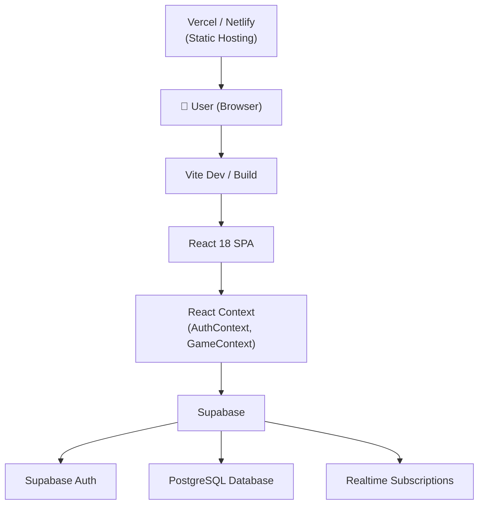

---

## 2. Frontend Structure

The `src/` directory is organized by responsibility:

| Folder | Purpose |
|--------|---------|
| `components/` | Reusable UI — Navbar, Layout, AnimatedBackground, EcoChatbot |
| `context/` | Global state — AuthContext, GameContext |
| `lib/` | Supabase client initialization |
| `pages/` | Route-level views — one file per page |
| `services/` | Data persistence helpers |

---

## 3. Page Routing Flow

React Router v7 handles client-side navigation. All routes are defined in `App.tsx`.

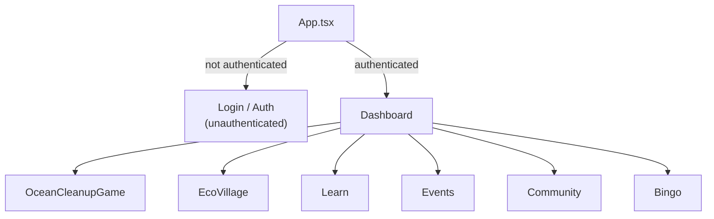

---

## 4. Component Structure

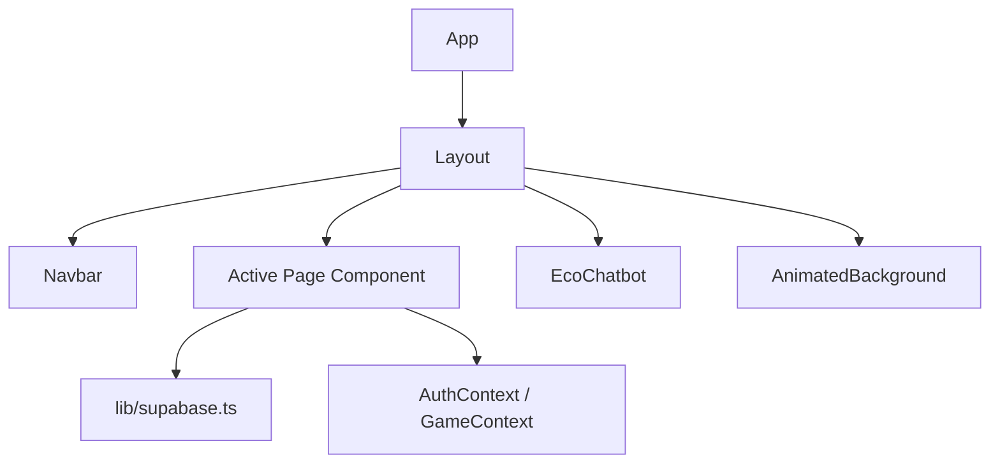

`Layout` wraps every authenticated page and renders the persistent Navbar and EcoChatbot alongside page content.

---

## 5. Global State Management

Two React Contexts manage shared state across the app:

| Context | Manages |
|---------|---------|
| `AuthContext` | Current user session, login/logout, auth state loading |
| `GameContext` | Points, levels, badges, daily challenge state |

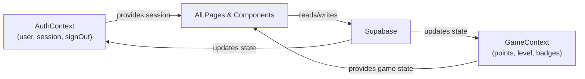

---

## 6. Authentication Flow

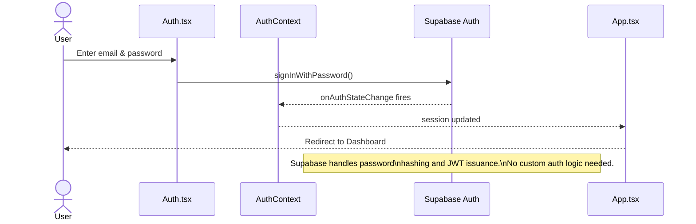

- Auth state is initialized in `AuthContext` via `supabase.auth.onAuthStateChange`.
- Protected routes check session from `AuthContext` before rendering.
- `Auth.tsx` and `Login.tsx` handle the sign-up and sign-in UI respectively.

---

## 7. Supabase Integration

`lib/supabase.ts` initializes a single Supabase client using environment variables:

```ts
import { createClient } from '@supabase/supabase-js'

export const supabase = createClient(
  import.meta.env.VITE_SUPABASE_URL,
  import.meta.env.VITE_SUPABASE_ANON_KEY
)
```

This client is imported wherever DB or auth access is needed. All queries are automatically scoped to the authenticated user via RLS.

---

## 8. Database Interaction

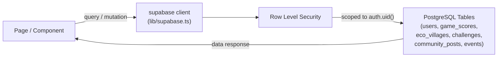

All tables have RLS enabled — users can only read and write their own data unless explicitly granted broader access (e.g. leaderboards).

---

## 9. Real-Time Updates

Supabase Realtime is used for live leaderboards and community post feeds.

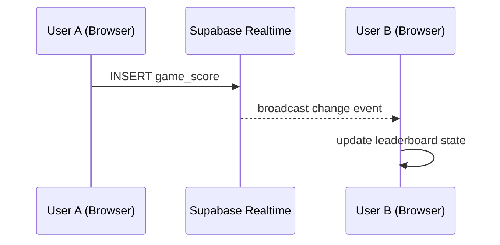

Subscriptions are set up with `supabase.channel()` inside `useEffect` hooks and cleaned up on component unmount.

---

## 10. Game Flow

### Ocean Cleanup Game

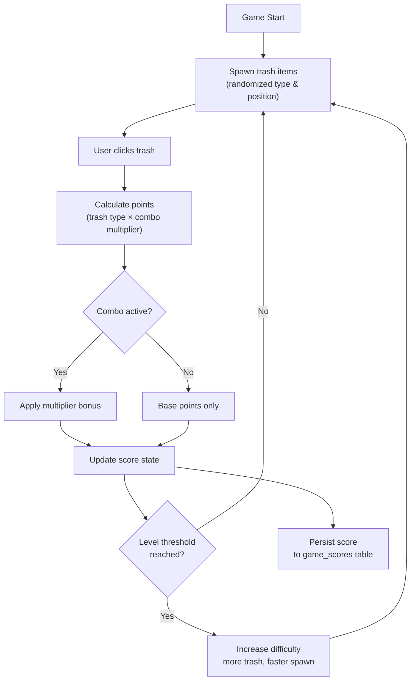

### Eco Village

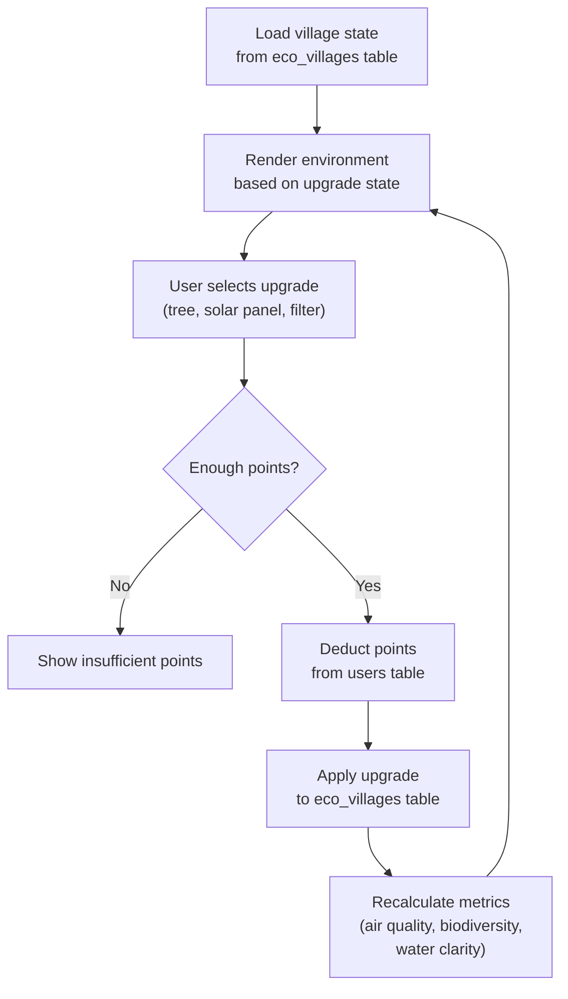

---

## 11. AI Chatbot Flow

The current EcoBot uses local keyword matching. No external API is called.

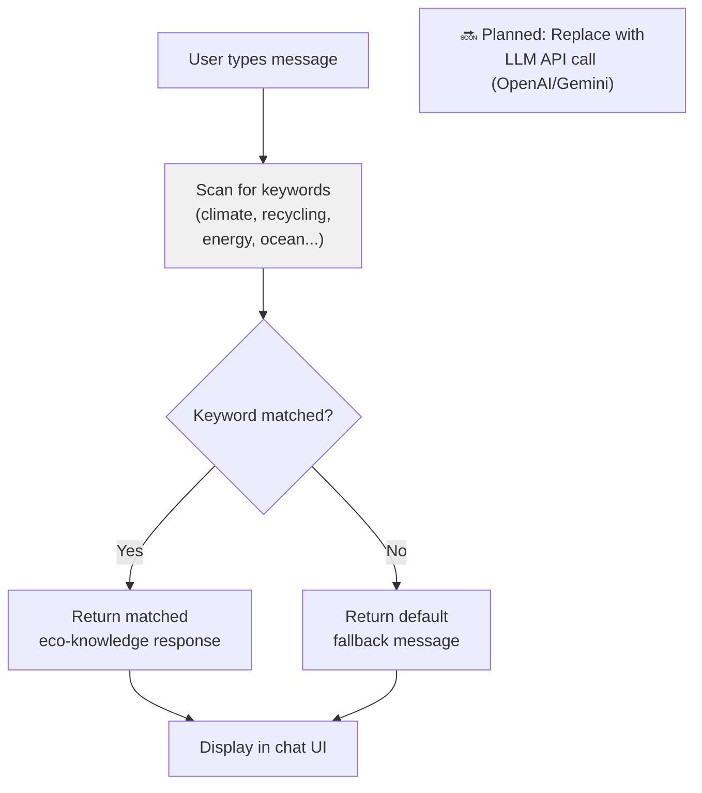

See the [AI Roadmap in README](../README.md#ai-chatbot--roadmap) for planned LLM integration.

---

## 12. Data Persistence Flow

`services/persistence.ts` handles saving game state:

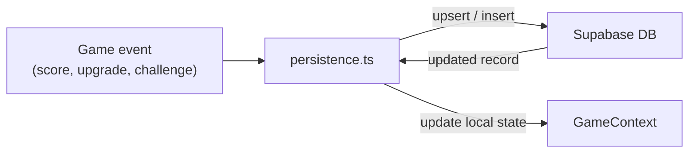

---

## 13. Error Handling

`ErrorBoundary.tsx` wraps the React tree and catches unhandled render errors, preventing a full blank-screen crash.

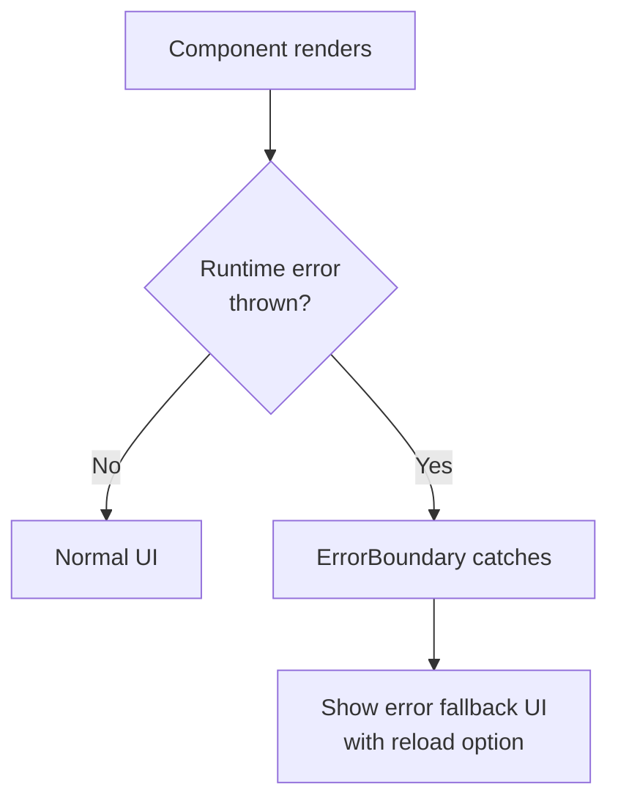

Supabase query errors are handled at the call site — components check for `error` in the response and render appropriate UI states (empty state, retry button).

---

## 14. Build and Deployment Flow

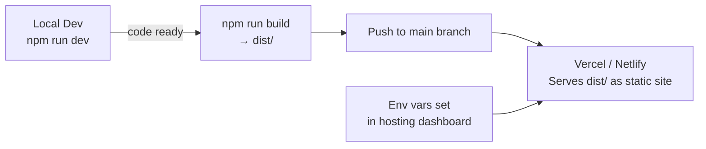

- Vite compiles TypeScript and bundles all assets into `dist/`.
- The `dist/` folder is a fully static site — no server runtime required.
- Environment variables (`VITE_SUPABASE_URL`, `VITE_SUPABASE_ANON_KEY`) must be set in the hosting platform's dashboard before deploying.